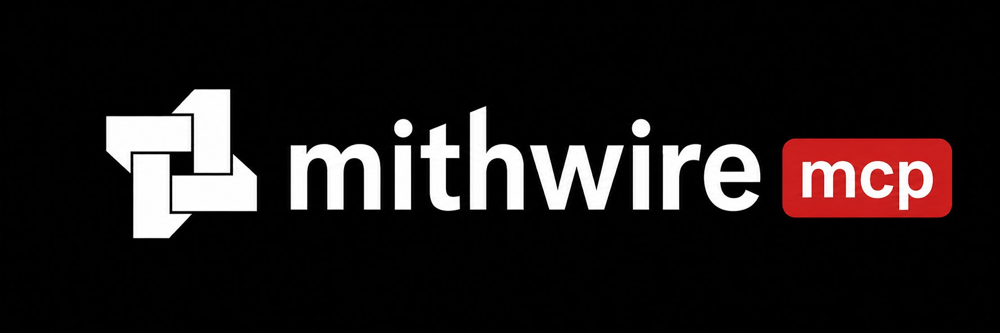

<p align="center">
  
</p>

<p align="center">
  <b>🤖 Build, test, and debug web automations with AI agents.</b><br>
  An MCP server that gives LLM agents direct control over stealth Chromium browsers.<br>
  <b>Dual Engine (CDP + CloakBrowser) • Live Debugging • Proxy Alignment • Persistent Profiles</b>
</p>

<p align="center">
  <a href="https://pypi.org/project/mithwire-mcp/"></a>
  <a href="https://pypi.org/project/mithwire-mcp/"></a>
  <a href="https://modelcontextprotocol.io"></a>
  <a href="LICENSE"></a>
  <a href="https://github.com/codeisalifestyle/mithwire"></a>
</p>

---

## 💡 What is Mithwire MCP?

[`mithwire`](https://github.com/codeisalifestyle/mithwire) is a production-ready anti-detect browser engine. **Mithwire MCP** is the Model Context Protocol server that exposes Mithwire's stealth browser capabilities directly to AI models like **Claude, Cursor, and autonomous agents**.

Instead of manually writing fragile browser-automation glue code, you can **hand over the MCP server to an AI agent** to build, execute, test, and debug web automations autonomously.

Your AI agent can invoke structured MCP tools (`session_start`, `browser_navigate`, `browser_click`, `browser_snapshot`, `browser_solve_cloudflare`) to explore pages, handle logins and captchas, capture console and network logs, and inspect DOM state in real time.

---

## 🛠️ Built for Developing & Debugging Automations

Mithwire MCP was designed specifically as an interactive development harness for AI agents and human developers:

- 🤖 **Autonomous Automation Authoring:** Give your AI agent a high-level prompt ("Build a script that logs into service X and downloads report Y"). The agent uses MCP tools to navigate, find selectors, verify state, and iterate until the script works.
- 🔍 **Live Inspection & Diagnostics:** Agents can capture DOM snapshots, monitor JavaScript console errors, record full CDP network traces, and read storage/cookies at any point during execution.
- 🖥️ **Visual VNC Debugging:** Pre-packaged with an embedded noVNC web viewer (`http://localhost:6080/vnc.html`). Watch your AI agent interact with the browser live in your desktop browser.
- 🧪 **E2E Test Prototyping:** Rapidly prototype and debug resilient scrapers and workflows without getting blocked by anti-bot protections.

---

## 💥 The Problem for AI Agents

When AI agents attempt web operations using traditional tools (Playwright, Puppeteer, Selenium, or standard web fetchers), they immediately hit anti-bot walls:

- ❌ **Instant Anti-Bot Blocks:** Standard automation frameworks leak `navigator.webdriver = true` and ChromeDriver artifacts, triggering Cloudflare, Akamai, and DataDome challenges.
- ❌ **Proxy & IP Mismatches:** Agents using proxies often leak their host IP via STUN/WebRTC or present timezone/locale settings that contradict their proxy exit location.
- ❌ **State Loss Across Turns:** AI agents frequently lose cookies, session state, or local storage between execution turns or subagent invocations.

---

## 🛡️ The Mithwire MCP Solution

Mithwire MCP solves these challenges natively for AI agent workflows:

1. 🥷 **Stealth by Design:** Operates on Mithwire—no WebDriver, no Selenium, zero `navigator.webdriver` leaks, with built-in Cloudflare Turnstile bypass.
2. ⚡ **Dual Stealth Engines:** Support for both lightweight `cdp` mode (standard Chrome) and C++-patched `stealth` mode (CloakBrowser) per session.
3. 🌍 **Automatic Proxy & Egress Alignment:** Auto-probes proxy health before launching Chromium and aligns timezone, locale, languages, and geolocation to match the proxy exit IP.
4. 👤 **Persistent Profiles & State Store:** Reusable browser profiles (`profiles/`) store cookies, localStorage, proxies, and persisted fingerprints across agent runs.
5. 🔒 **WebRTC Leak Protection:** Automatically guards STUN/UDP queries against leaking the host's real IP address.

---

## ⚡ Engine Modes & Capabilities

Configure stealth levels on a per-session or per-profile basis:

| Engine Mode | Binary | Capabilities | Best Suited For |
| :--- | :--- | :--- | :--- |
| **`cdp`** (Default) | Stock Chrome / Chromium | Fast, reliable CDP `Emulation` overrides for timezone, locale, geo, UA, platform, and device metrics. | Local workstations, remote Linux servers (same-OS profiles or standard targets), fast script prototyping. |
| **`stealth`** | [CloakBrowser] | C++ source code patches for Canvas, WebGL GPU strings, AudioContext, native fonts, and TLS signatures. | Cross-OS profiles (e.g. Windows profile on a Linux VPS), cloud agents, high-security anti-bot targets. |

---

## ✨ Key Features & Capabilities

- 🤖 **Complete Agent Toolset:** Full toolsuite covering navigation, DOM querying, clicking, typing, scrolling, screenshots, network capture, and JS evaluation.
- 🧩 **Cloudflare Bypass:** Solves Cloudflare Turnstile challenges on command via `browser_solve_cloudflare`.
- 🗂️ **Centralized State Store:** Default `~/.mithwire-mcp` directory manages persistent profiles, proxy registries, and cookie import/export files.
- 🛰️ **Proxy Registry & Alignment:** Store proxy credentials once and reference them by name. Automatically validates proxy health and aligns timezone/locale/geo before Chromium launches.
- 🐳 **Docker-Ready with Visual Debugging:** Pre-configured Docker container with Xvfb, CloakBrowser, and noVNC web viewer (`http://localhost:6080/vnc.html`).

---

## 🚀 Installation

```bash
# Standard install (CDP mode)
pip install mithwire-mcp

# With Stealth Mode support (CloakBrowser)
pip install "mithwire-mcp[stealth]"
```

---

## 💻 MCP Client Configuration

Add Mithwire MCP to your MCP client config (e.g. Cursor, Claude Desktop):

```json
{
  "mcpServers": {
    "mithwire-mcp": {
      "command": "mithwire-mcp",
      "args": ["--transport", "stdio"]
    }
  }
}
```

---

## 🐳 Running in Docker (With Visual VNC Debugging)

For isolated execution or local visual observation:

```bash
# Pull public Docker image
docker pull ghcr.io/codeisalifestyle/mithwire-mcp:latest

# Run local dev container with noVNC enabled
docker compose -f docker-compose.dev.yml up -d --build
```

**Endpoints:**
- 🔌 **MCP Server (Streamable HTTP):** `http://localhost:7867`
- 🖥️ **noVNC Visual Viewer:** `http://localhost:6080/vnc.html`

---

## 🧰 Available MCP Tools Reference

<details>
<summary><b>🔁 Session Lifecycle & Profile Management</b></summary>

- `session_start` - Launch a new browser session (ephemeral or persistent profile)
- `session_list` - List active browser sessions
- `session_get` - Get session status and identity metadata
- `session_stop` - Close a specific session
- `session_stop_all` - Terminate all running sessions
- `session_profile_list` / `session_profile_set` / `session_profile_delete` - Profile management
- `session_proxy_list` / `session_proxy_set` / `session_rotate_proxy` - Proxy registry & rotation
</details>

<details>
<summary><b>🎮 Browser Navigation & DOM Actions</b></summary>

- `browser_navigate` / `browser_back` / `browser_forward` / `browser_reload` - Navigation
- `browser_snapshot` - Take interactive DOM snapshot with element references
- `browser_query` - Find elements by CSS selector or text
- `browser_click` / `browser_mouse_click` / `browser_type` - User interactions
- `browser_scroll` / `browser_wait_for_selector` / `browser_wait_for_text` - Waits and positioning
- `browser_take_screenshot` - Capture page screenshot
- `browser_solve_cloudflare` - Automatically solve Cloudflare Turnstile challenge
</details>

<details>
<summary><b>📡 Cookies, Storage & Network Capture</b></summary>

- `browser_cookies_get` / `browser_cookies_set` / `browser_cookies_save` / `browser_cookies_clear`
- `browser_storage_get` / `browser_storage_set` / `browser_storage_clear`
- `browser_console_messages` / `browser_network_requests`
- `browser_network_capture_start` / `browser_network_capture_get` / `browser_network_capture_stop`
</details>

---

## 📜 License

Distributed under the **MIT License**. Powered by [**mithwire**](https://github.com/codeisalifestyle/mithwire) (AGPL-3.0).
